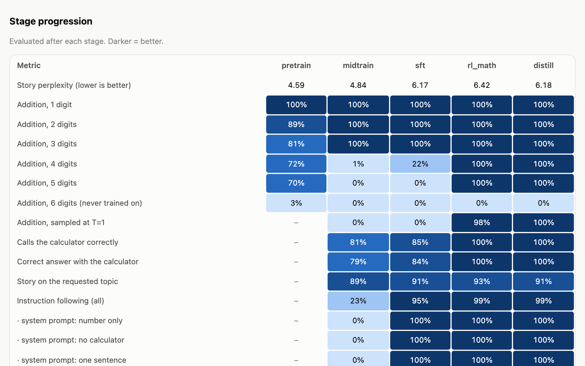
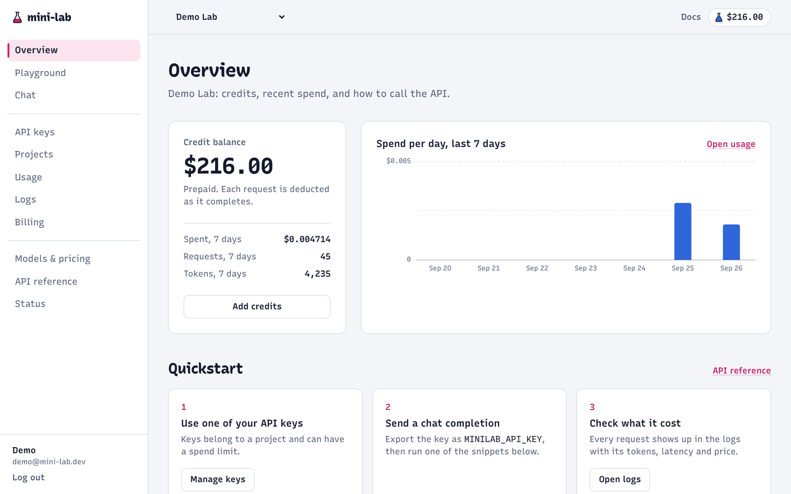
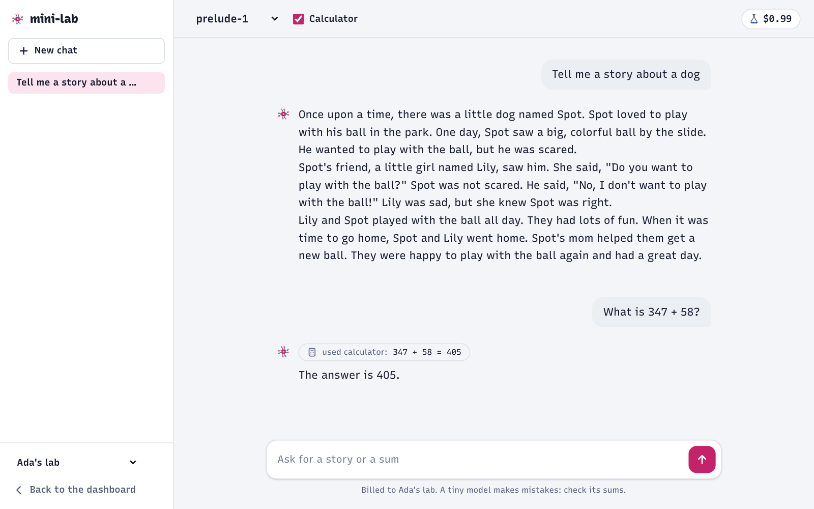

<p align="center">
  
</p>

<h1 align="center">mini-lab</h1>

<p align="center"><strong>A whole AI lab, small enough to read.</strong></p>

<p align="center">
  <a href="https://github.com/cthiriet/mini-lab/actions/workflows/ci.yml"></a>
  <a href="LICENSE"></a>
  
  
</p>

mini-lab trains a tiny language model from scratch on a laptop, serves it behind an OpenAI-compatible API, and bills every token from prepaid credits through a developer platform with API keys, usage, logs and a chat app.

Each part of a real lab has a minimal, readable version here:

| | What | Where |
|---|---|---|
| **Research** | Tokenizer, pretraining (Muon), midtraining, SFT, RL (GRPO), on-policy distillation, evals, model cards, training reports | [`minilab/train`](minilab/train), [`minilab/eval`](minilab/eval), [docs/training.md](docs/training.md) |
| **Inference** | KV cache, continuous batching, streaming, tool calls, stop strings | [`minilab/inference`](minilab/inference), [docs/inference.md](docs/inference.md) |
| **API** | OpenAI-compatible `/v1/chat/completions`, API keys, rate limits, metering | [`minilab/api`](minilab/api), [docs/api.md](docs/api.md) |
| **Platform** | Sign-up, orgs and projects, API keys, usage, logs, billing (Stripe), playground, docs | [`minilab/platform`](minilab/platform), [docs/platform.md](docs/platform.md) |
| **Product** | A ChatGPT-like chat app with a calculator tool | [`minilab/chat`](minilab/chat) |

Everything runs on a CPU. The whole training pipeline, from raw text to a released model, runs in about 31 minutes on a laptop with an Apple Silicon GPU, or about 70 minutes on its CPU alone.

## The model: `mini-3.1`

A 5.8M-parameter GPT that writes short children's stories and adds numbers, either step by step or with a calculator tool. It's tiny on purpose: every training stage has an effect you can measure.

Releases are named like the labs' models: a new number for a new recipe, a point release for a significant fix. `mini-2` brought [Muon](docs/training.md#what-we-tuned-and-why) and a math specialist distilled into the SFT model, instead of AdamW and a single RL run (story perplexity 7.37 → 6.39, 5-digit additions 91% → 100%). `mini-2.1` fixed multi-turn chats: follow-ups on a 4-5 digit total went from 37% to 97%. `mini-3` spends twice the compute on pretraining, where [a small scaling law](docs/training.md#what-we-tuned-and-why) said it pays most (story perplexity 6.46 → 5.75). `mini-3.1` stops reading every request after an answer as more math ("tell me a story" got a calculator call). All [releases](docs/training.md#releases).

| Stage | What it teaches |
|---|---|
| **Pretraining** | Language: next-token prediction on [TinyStories](https://huggingface.co/datasets/roneneldan/TinyStories) and arithmetic worksheets |
| **Midtraining** | The chat format and skills: turns, step-by-step reasoning, calculator calls |
| **SFT** | Behavior: follow system prompts and multi-turn follow-ups, politely refuse what it can't do |
| **RL (GRPO)** | Practice: a math specialist extends step-by-step addition to longer numbers it was never shown in SFT |
| **Distillation** | One model from two teachers: the math specialist on additions, the SFT model on everything else |

Each stage is evaluated, and the training report shows what it changed (addition of 4 and 5 digits only appears with RL; instruction following with SFT). A release gate then evaluates the new model next to the previous release, whole chats included, and blocks any regression:

<p align="center"></p>

See [docs/training.md](docs/training.md) for the full results and what we learned along the way (including three reward hacks RL found).

## The platform

Sign up, get an API key, call the model with the official OpenAI SDK, and watch every token get billed. Or just chat with it.

<p align="center">
  
  
</p>

## Quickstart

You need [uv](https://docs.astral.sh/uv/) and a laptop; no GPU required (macOS or Linux; on Windows, use WSL).

```bash
git clone https://github.com/cthiriet/mini-lab && cd mini-lab
uv sync
```

**1. Train a model** (downloads about 200 MB of TinyStories, then trains all five stages and releases `models/mini-3.1`):

```bash
bash speedrun.sh small
```

It ends with an eval table per stage and writes a training report with every curve to `runs/small/report.html`. To open it, or to compare runs:

```bash
uv run python -m minilab.report runs/small --open
```

To try the serving stack without training, create a random-weight model instead: `uv run python -m minilab.testing models`.

**2. Start the lab** (inference on :8001, API on :8000, platform on :3000):

```bash
./scripts/serve.sh
```

Open http://127.0.0.1:3000, sign up (new accounts get $1.00 of free credits), create an API key, and call the API with the official OpenAI SDK:

```python
from openai import OpenAI

client = OpenAI(base_url="http://127.0.0.1:8000/v1", api_key="sk-mini-...")
reply = client.chat.completions.create(
    model="mini-3.1",
    messages=[{"role": "user", "content": "What is 347 + 58?"}],
)
print(reply.choices[0].message.content)
```

The request shows up in **Logs**, its cost in **Usage** and **Billing**. Try the chat app at http://127.0.0.1:3000/chat.

**Docker:** after training (or creating a random model), set a secret for the internal token and start the three services:

```bash
echo "MINILAB_INTERNAL_TOKEN=$(openssl rand -hex 32)" >> .env
docker compose up --build
```

## How it fits together

```
 browser ──► platform :3000 ─┐  internal token          your code (openai SDK) ── sk-mini-... ──┐
                             ▼                                                                   ▼
                        api gateway :8000   auth · rate limits · metering · logs ──► SQLite
                             │
                             ▼
                        inference :8001     chat template · KV cache · continuous batching
                             │
                             ▼
                        models/mini-3.1     ◄── bash speedrun.sh small
```

More in [docs/architecture.md](docs/architecture.md).

## Repository layout

```
minilab/
  tokenizer/    BPE from scratch (digits always split) + chat template
  model/        the transformer, KV cache, sampling
  data/         TinyStories download, synthetic arithmetic and conversations
  train/        tokenizer, pretrain, midtrain, sft, rl (GRPO)
  eval/         evals and model card
  report.py     HTML training report for one or more runs
  release.py    promote a run to models/<id>
  inference/    engine + internal server
  api/          public OpenAI-compatible gateway
  platform/     dashboard, billing, playground, docs
  chat/         chat app
  db/           SQLite schema and data access
configs/        tiny (CI smoke test) and small (the speedrun)
tests/          unit tests, service tests, and an end-to-end test of the whole stack
```

## Tests

```bash
uv run pytest
```

This covers the tokenizer, the model and its KV cache, continuous batching (checked token for token against sequential generation), the gateway against the official `openai` SDK, the platform (auth, org isolation, Stripe webhooks), and an end-to-end run of the three real services. CI also runs `bash speedrun.sh tiny` and builds the Docker image.

## Contributing

Contributions are welcome, especially ones that make a part of the lab clearer or smaller. See [CONTRIBUTING.md](CONTRIBUTING.md). To report a security issue, see [SECURITY.md](SECURITY.md).

## Limitations

- `mini-3.1` is a toy. It tells simple stories and adds numbers; it does not know anything else, and says so.
- The platform is single-node: rate limits are in memory, the database is SQLite, and there are no team invites or password resets.
- Payments use Stripe in test mode. Without Stripe keys, a clearly labeled test-mode button adds credits.

## Acknowledgements

Inspired by Andrej Karpathy's [nanoGPT](https://github.com/karpathy/nanoGPT) and [nanochat](https://github.com/karpathy/nanochat), Sebastian Raschka's [LLMs-from-scratch](https://github.com/rasbt/LLMs-from-scratch), and [nano-vllm](https://github.com/GeeeekExplorer/nano-vllm). Training data: [TinyStories](https://arxiv.org/abs/2305.07759) (Eldan & Li, 2023).

## License

MIT
